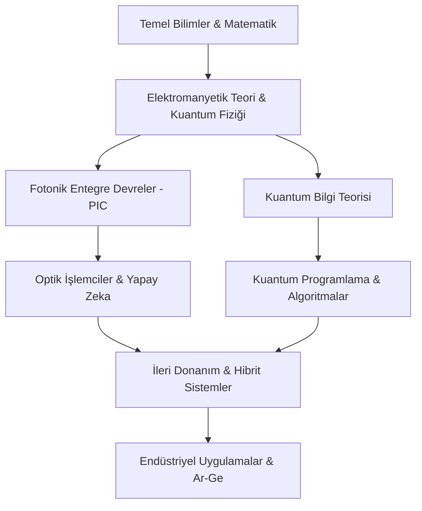

# 🌌 Fotonik ve Kuantum Mühendisliği Akademik Müfredatı

Bu portal, 21. yüzyılın en kritik teknolojik sıçramalarından biri olan **Işık Tabanlı Hesaplama** ve **Kuantum Teknolojileri** üzerine inşa edilmiş hibrit bir mühendislik müfredatıdır. Geleneksel elektronik mimarilerin (von Neumann darboğazı) sınırlarına ulaştığı günümüzde, fotonlar ve kuantum durumları üzerinde kontrol kurmak, geleceğin süper-hesaplama, güvenli haberleşme ve yapay zeka sistemlerinin anahtarını sunmaktadır.

---

## 🎯 Vizyon ve Eğitim Felsefesi

Bu müfredat, sadece teorik bilgi aktarımını değil, aynı zamanda **"Tasarım Odaklı Mühendislik"** (Design-Oriented Engineering) yaklaşımını benimser. Öğrenciler, Maxwell denklemlerinden başlayarak kendi Fotonik Entegre Devrelerini (PIC) tasarlayacak ve kuantum algoritmalarını gerçek donanımlar üzerinde test edebilecek yetkinliğe ulaşırlar.

*   **Bütünsel Yaklaşım:** Matematiksel temelden donanım prototiplemeye kadar uçtan uca eğitim.
*   **Açık Kaynak Ekosistemi:** `Meep`, `gdsfactory` ve `Qiskit` gibi endüstri standartlarındaki araçların entegrasyonu.
*   **Geleceğe Hazırlık:** Moore Yasası sonrası dönem için kuantum-dayanıklı çözümler ve optik yapay zeka sistemleri.

---

## 🚀 Yol Haritası: Bilgi Akışı ve Entegrasyon

---

## 📚 Kapsamlı 8 Dönemlik Mühendislik Müfredatı

### 🔵 1. Yıl: Bilimsel Temeller ve Sayısal Okuryazarlık
*   **Dönem 1:**
    * **Matematik I:** Kalkulus, limit, türev, integral ve seriler.
    * **Genel Fizik I:** Klasik mekanik ve termodinamik yasaları.
    * **Lineer Cebir:** Matris cebiri, Hilbert uzayları, kuantum durumlarının vektörel temsili.
    * **Programlama:** Python ile bilimsel hesaplama (NumPy, SciPy).
*   **Dönem 2:**
    * **Matematik II:** Çok değişkenli analiz ve diferansiyel denklemler.
    * **Genel Fizik II:** Elektromanyetizma ve Maxwell denklemlerine giriş.
    * **Modern Fizik:** Özel görelilik, fotoelektrik olay, kara cisim ışıması, Compton saçılması.
    * **Teknoloji Seminerleri:** Fotonik ve kuantum sektöründeki güncel trendler (Venture Capital ve Startup ekosistemi).

### 🟢 2. Yıl: Dalga Mekaniği ve Yarı-İletken Fiziği
*   **Dönem 3:**
    * **Elektromanyetik Teori I:** Elektrostatik, manyetostatik, dielektrik ortamlar ve enerji yoğunluğu.
    * **Klasik Optik:** Geometrik optik, dalga optiği (girişim, kırınım), polarizasyon kontrolü.
    * **Sinyaller ve Sistemler:** LTI sistemler, Fourier ve Laplace dönüşümleri, frekans domeninde filtreleme.
*   **Dönem 4:**
    * **Elektromanyetik Teori II:** Düzlemsel dalgalar, Fresnel katsayıları, metalik ve dielektrik dalga kılavuzları.
    * **Yarı İletken Fiziği:** Kristal yapıları, enerji bantları, Fermi-Dirac istatistiği, p-n eklem dinamiği.
    * **Kuantum Mekaniğine Giriş:** Schrödinger denklemi, Dirac notasyonu (Bra-Ket), gözlemlenebilirler ve operatör teorisi.

### 🟡 3. Yıl: Entegre Sistemler ve Optik Hesaplama
*   **Dönem 5:**
    * **Silikon Fotoniği:** Pasif bileşenler (MZI, Halka rezonatörler, yönsüz bağlaştırıcılar), mod analizleri (TE/TM).
    * **Lazer Fiziği:** Işığın madde ile etkileşimi, uyarılmış emisyon, optik kovuklar (cavity physics), lazer diyotlar.
    * **Kuantum Mekaniği II:** Açısal momentum, spin, pertürbasyon teorisi ve çok parçacıklı sistemler.
    * **Bilgisayar Organizasyonu:** CPU/GPU mimarileri ve veri iletimi sınırlamaları.
*   **Dönem 6:**
    * **Optik İşlemciler (ONN):** Matris-vektör çarpımı yapan optik ağlar, diffraktif optik nöral ağlar (DONN).
    * **PIC Tasarımı ve Layout:** E-beam ve fotolitografi süreçleri, `gdsfactory` ile maske tasarımı.
    * **Kuantum Bilgi Teorisi:** Entanglement (dolanıklık), Bell eşitsizlikleri, kuantum kapıları ve devre modeli.

### 🔴 4. Yıl: Kuantum Üstünlüğü ve İleri Uygulamalar
*   **Dönem 7:**
    * **Kuantum Donanımı:** Süperiletken kübitler, iyon tuzakları, nötr atomlar ve fotonik kuantum işlemciler.
    * **Kuantum Algoritmaları:** Grover, Shor, VQE ve QAOA algoritmaları; gürültülü (NISQ) cihazlarda programlama.
    * **Sayısal Modelleme Lab:** FDTD ve EME yöntemleri ile fotonik bileşen simülasyonları.
    * **Bitirme Projesi I:** Özgün bir fotonik/kuantum mimarisinin teorik tasarımı ve simülasyonu.
*   **Dönem 8:**
    * **Kuantum Kriptografi:** BB84, E91 protokolleri, QKD (Kuantum Anahtar Dağıtımı), kuantum internet vizyonu.
    * **Nanofotonik ve Metamalzemeler:** Plazmonikler, fotonik kristaller, negatif kırılma indeksi, süper-lensler.
    * **PIC Karakterizasyon Lab:** Fiber-to-chip bağlaşımı, spektral analiz ve deneysel veri toplama süreçleri.
    * **Bitirme Projesi II:** Tasarlanan sistemin performans analizi ve akademik raporlama/yayın süreci.

---

## 🏗️ Endüstriyel Uygulama Alanları

Fotonik ve Kuantum Mühendisliği mezunları aşağıdaki alanlarda devrim yaratacak projelerde yer alırlar:

1.  **Veri Merkezleri (Datacenters):** Optik ara bağlantılar (interconnects) ile enerji tasarruflu ve yüksek hızlı veri iletimi.
2.  **Yapay Zeka Donanımları:** Optik sinir ağları ile binlerce kat daha hızlı çıkarım (inference) yeteneği.
3.  **Savunma ve Güvenlik:** Kuantum kriptografi ile kırılması imkansız iletişim kanalları ve hassas optik sensörler (LiDAR).
4.  **Biyomedikal:** Işık tabanlı tanı kitleri, fotonik biyosensörler ve ileri görüntüleme teknikleri.
5.  **Finans:** Kuantum algoritmaları ile karmaşık portföy optimizasyonu ve risk analizleri.

---

## 🛠️ Yazılım ve Simülasyon Ekosistemi

Bu müfredat, öğrencilerin teoriyi pratiğe dökmesi için aşağıdaki araçları aktif olarak kullanır:

| Alan | Araç | Açıklama |
| :--- | :--- | :--- |
| **EM Simülasyon** | [Meep](https://meep.readthedocs.io/) | FDTD yöntemi ile dalga yayılım analizi. |
| **Mod Analizi** | [EMpy](https://github.com/chriskeraly/EMpy) | Dalga kılavuzu modlarını ve kayıplarını hesaplama. |
| **PIC Layout** | [gdsfactory](https://gdsfactory.github.io/gdsfactory/) | Python tabanlı GDSII üretim otomasyonu. |
| **Kuantum Programlama** | [Qiskit](https://qiskit.org/) | IBM Quantum sistemleri için devre tasarımı. |
| **Kuantum ML** | [PennyLane](https://pennylane.ai/) | Diferansiyellenebilir kuantum hesaplama. |
| **Fotonik Kuantum** | [Strawberry Fields](https://strawberryfields.ai/) | Fotonik tabanlı kuantum bilgisayar simülatörü. |

---

## 🌍 Kariyer Yolları ve Gelecek Projeksiyonu

Bu alanda uzmanlaşan mühendisler; **Google Quantum AI**, **Intel Photonics**, **Xanadu**, **IBM Research** ve **ASML** gibi dünya devlerinde veya derin teknoloji (Deep-Tech) startup'larında şu pozisyonlarda çalışabilirler:
*   PIC Tasarım Mühendisi (Design Engineer)
*   Kuantum Algoritma Araştırmacısı (Quantum Researcher)
*   Optoelektronik Sistem Mimarı
*   Nanofabrikasyon Uzmanı
*   Kuantum Haberleşme Güvenliği Uzmanı

---

## 🤝 Katkıda Bulunma ve Komünite

Bu müfredat, sürekli gelişen bir ekosistemdir. Katkılarınızla Türkiye'deki fotonik ve kuantum okuryazarlığını artırabiliriz:

1.  **Ders Notları:** Eksik gördüğünüz teknik konuları Markdown formatında ekleyebilirsiniz.
2.  **Simülasyonlar:** Yeni bileşen tasarımları veya algoritma örnekleri gönderebilirsiniz.
3.  **Hata Bildirimi:** Teknik veya yazım hataları için **Issue** açabilirsiniz.

---

## 📜 Lisans ve Kullanım Koşulları

Bu proje **MIT Lisansı** altında korunmaktadır. Eğitim ve araştırma amacıyla, kaynak gösterilerek serbestçe kullanılabilir. 

> *"Işık, geleceği aydınlatmakla kalmaz; onu hesaplar ve iletir."*