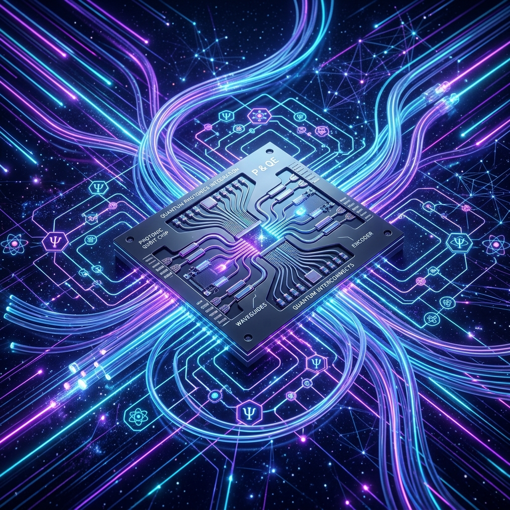
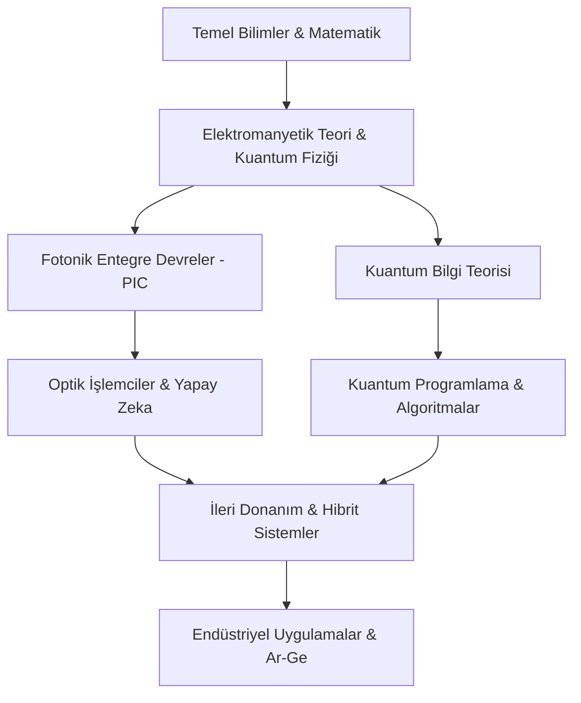

  

# 🌌 Fotonik ve Kuantum Mühendisliği Akademik Müfredatı

Bu portal, 21. yüzyılın en kritik teknolojik sıçramalarından biri olan **Işık Tabanlı Hesaplama** ve **Kuantum Teknolojileri** üzerine inşa edilmiş hibrit bir mühendislik müfredatıdır. Geleneksel elektronik mimarilerin (von Neumann darboğazı) sınırlarına ulaştığı günümüzde, fotonlar ve kuantum durumları üzerinde kontrol kurmak, geleceğin süper-hesaplama, güvenli haberleşme ve yapay zeka sistemlerinin anahtarını sunmaktadır.

---

## 🎯 Vizyon ve Eğitim Felsefesi

Bu müfredat, sadece teorik bilgi aktarımını değil, aynı zamanda **"Tasarım Odaklı Mühendislik"** (Design-Oriented Engineering) yaklaşımını benimser. Öğrenciler, Maxwell denklemlerinden başlayarak kendi Fotonik Entegre Devrelerini (PIC) tasarlayacak ve kuantum algoritmalarını gerçek donanımlar üzerinde test edebilecek yetkinliğe ulaşırlar.

*   **Bütünsel Yaklaşım:** Matematiksel temelden donanım prototiplemeye kadar uçtan uca eğitim.
*   **Açık Kaynak Ekosistemi:** `Meep`, `gdsfactory` ve `Qiskit` gibi endüstri standartlarındaki araçların entegrasyonu.
*   **Geleceğe Hazırlık:** Moore Yasası sonrası dönem için kuantum-dayanıklı çözümler ve optik yapay zeka sistemleri.

---

## 🚀 Yol Haritası: Bilgi Akışı ve Entegrasyon

---

## 📚 Kapsamlı 8 Dönemlik Mühendislik Müfredatı

### 🔵 1. Yıl: Bilimsel Temeller ve Sayısal Okuryazarlık
*   **Dönem 1:**
    * **Matematik I:** Kalkulus, limit, türev, integral ve seriler.
    * **Genel Fizik I:** Klasik mekanik ve termodinamik yasaları.
    * **Lineer Cebir:** Matris cebiri, Hilbert uzayları, kuantum durumlarının vektörel temsili.
    * **Programlama:** Python ile bilimsel hesaplama (NumPy, SciPy).
*   **Dönem 2:**
    * **Matematik II:** Çok değişkenli analiz ve diferansiyel denklemler.
    * **Genel Fizik II:** Elektromanyetizma ve Maxwell denklemlerine giriş.
    * **Modern Fizik:** Özel görelilik, fotoelektrik olay, kara cisim ışıması, Compton saçılması.
    * **Teknoloji Seminerleri:** Fotonik ve kuantum sektöründeki güncel trendler.

### 🟢 2. Yıl: Dalga Mekaniği ve Yarı-İletken Fiziği
*   **Dönem 3:**
    * **Elektromanyetik Teori I:** Elektrostatik, manyetostatik, dielektrik ortamlar ve enerji yoğunluğu.
    * **Klasik Optik:** Geometrik optik, dalga optiği (girişim, kırınım), polarizasyon kontrolü.
    * **Sinyaller ve Sistemler:** LTI sistemler, Fourier ve Laplace dönüşümleri.
*   **Dönem 4:**
    * **Elektromanyetik Teori II:** Düzlemsel dalgalar, Fresnel katsayıları, metalik ve dielektrik dalga kılavuzları.
    * **Yarı İletken Fiziği:** Kristal yapıları, enerji bantları, Fermi-Dirac istatistiği.
    * **Kuantum Mekaniğine Giriş:** Schrödinger denklemi, Dirac notasyonu (Bra-Ket).

### 🟡 3. Yıl: Entegre Sistemler ve Optik Hesaplama
*   **Dönem 5:**
    * **Silikon Fotoniği:** Pasif bileşenler (MZI, Halka rezonatörler, yönsüz bağlaştırıcılar).
    * **Lazer Fiziği:** Işığın madde ile etkileşimi, uyarılmış emisyon, optik kovuklar.
    * **Kuantum Mekaniği II:** Açısal momentum, spin, pertürbasyon teorisi.
*   **Dönem 6:**
    * **Optik İşlemciler (ONN):** Matris-vektör çarpımı yapan optik ağlar, DONN.
    * **PIC Tasarımı ve Layout:** gdsfactory ile maske tasarımı ve fabrikasyon süreçleri.
    * **Kuantum Bilgi Teorisi:** Entanglement, Bell eşitsizlikleri, kuantum kapıları.

### 🔴 4. Yıl: Kuantum Üstünlüğü ve İleri Uygulamalar
*   **Dönem 7:**
    * **Kuantum Donanımı:** Süperiletken kübitler, iyon tuzakları ve fotonik işlemciler.
    * **Kuantum Algoritmaları:** Grover, Shor, VQE ve QAOA algoritmaları.
    * **Sayısal Modelleme Lab:** FDTD ve EME yöntemleri.
*   **Dönem 8:**
    * **Kuantum Kriptografi:** BB84, QKD, kuantum internet vizyonu.
    * **Nanofotonik ve Metamalzemeler:** Plazmonikler, fotonik kristaller.
    * **Bitirme Projesi II:** Prototip tasarım ve akademik raporlama.

---

## 🏗️ Endüstriyel Uygulama Alanları

1.  **Veri Merkezleri:** Ultra-hızlı optik interconnect sistemleri.
2.  **Yapay Zeka:** Işık hızında çalışan optik çıkarım (inference) motorları.
3.  **Savunma:** Kuantum anahtar dağıtımı (QKD) ile güvenli iletişim.
4.  **Biyomedikal:** Nanofotonik biyosensörler ve ileri görüntüleme.

---

## 🛠️ Yazılım ve Simülasyon Ekosistemi

| Alan | Araç | Açıklama |
| :--- | :--- | :--- |
| **EM Simülasyon** | [Meep](https://meep.readthedocs.io/) | FDTD yöntemi ile dalga yayılım analizi. |
| **PIC Layout** | [gdsfactory](https://gdsfactory.github.io/gdsfactory/) | Python tabanlı GDSII üretim otomasyonu. |
| **Kuantum Hesaplama** | [Qiskit](https://qiskit.org/) | IBM Quantum programlama çerçevesi. |
| **Kuantum ML** | [PennyLane](https://pennylane.ai/) | Kuantum makine öğrenmesi. |

---

## 📜 Lisans

Bu proje **MIT Lisansı** altında lisanslanmıştır.